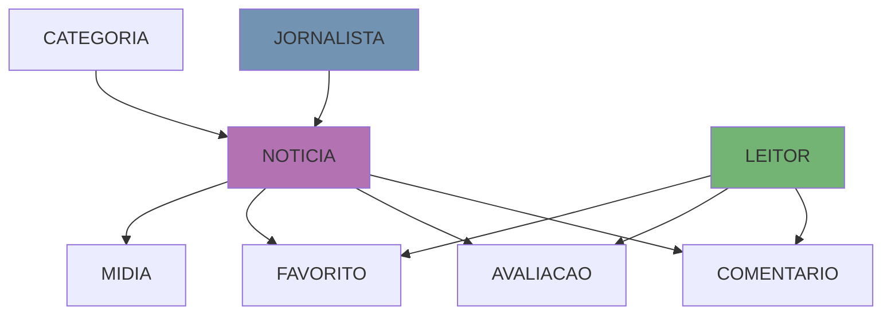

<h1 align="center">Atividade — Estudo de Caso: Portal de Notícias Web</h1>

  <a href="https://github.com/https-shini/bd-avancado" >Home</a>
  &nbsp;&nbsp;&nbsp;|&nbsp;&nbsp;&nbsp;
  <a href="https://github.com/https-shini/bd-avancado/blob/main/Aula01/Aula01.md">Aula01</a>
  &nbsp;&nbsp;&nbsp;|&nbsp;&nbsp;&nbsp;
  <a href="#-enunciado-da-atividade">Enunciado</a>
    &nbsp;&nbsp;&nbsp;|&nbsp;&nbsp;&nbsp;
  <a href="#-atributos-por-entidade">Entidades Identificadas</a>
    &nbsp;&nbsp;&nbsp;|&nbsp;&nbsp;&nbsp;
  <a href="#-entidades-identificadas">Atributos por Entidade</a>
    &nbsp;&nbsp;&nbsp;|&nbsp;&nbsp;&nbsp;
  <a href="#-relacionamentos-e-cardinalidades">Cardinalidades</a>

## 📋 Enunciado da Atividade

Uma empresa de mídia digital está desenvolvendo um portal de notícias online com o objetivo de publicar conteúdos informativos em diversas áreas, como política, esportes, tecnologia, cultura e economia. Para isso, é necessário projetar um banco de dados relacional que armazenará todos os dados relevantes para o sistema.

### Requisitos:
1. O portal possui diversos jornalistas cadastrados, cada um com seu nome completo, e-mail, telefone e data de contratação.
2. As notícias publicadas devem conter título, conteúdo, data de criação, horário e status (rascunho, publicada ou arquivada).
3. Cada notícia é escrita por um ou mais jornalistas.
4. As notícias podem conter imagens e vídeos, com descrição e link de mídia externa ou arquivo.
5. As notícias são organizadas em categorias, como esporte, política, tecnologia, etc. Uma notícia deve pertencer a apenas uma categoria.
6. Os leitores podem se cadastrar no portal, informando nome, e-mail e data de nascimento.
7. Leitores podem comentar as notícias. Cada comentário deve ter conteúdo textual, data e hora do envio, além de estar associado a um único leitor e uma única notícia.
8. Leitores também podem avaliar as notícias (com uma nota de 1 a 5) e salvá-las em uma lista pessoal de favoritos.
9. O sistema deve permitir buscas por palavras-chave nos títulos e conteúdos das notícias.

### Exercicio:
 - Identifique as entidades necessárias para o banco de dados da empresa de mídia digital;
 - Para cada entidade, liste os atributos necessários; 
 - Defina os relacionamentos entre as entidades, especificando os tipos de cardinalidade (1:1, 1:N, N:N).

---

## 🏗️ Arquitetura do Banco de Dados

### 📊 Entidades Identificadas

Com base nos requisitos apresentados, foram identificadas as seguintes entidades para o banco de dados:

- **JORNALISTA**
- **NOTICIA**
- **CATEGORIA**
- **LEITOR**
- **COMENTARIO**
- **AVALIACAO**
- **FAVORITO**
- **MIDIA**

---

## 📚 Atributos por Entidade

### 2.1 Jornalista
Representa os profissionais responsáveis pela criação das notícias.

<strong>Estrutura da Tabela JORNALISTA</strong>

- **id_jornalista** (PK - Chave Primária)
- nome_completo
- email
- telefone
- data_contratacao

| Atributo | Tipo | Observação |
|----------|------|------------|
| `id_jornalista` | `INTEGER (PK)` | Identificador único |
| `nome_completo` | `VARCHAR(255)` | Nome completo do jornalista |
| `email` | `VARCHAR(255)` | Único, para contato |
| `telefone` | `VARCHAR(20)` | Número de telefone |
| `data_contratacao` | `DATE` | Data em que foi contratado |

---

### 2.2 Categoria  
Representa as diferentes classificações das notícias (esporte, política, tecnologia, etc.).

<strong>Estrutura da Tabela CATEGORIA</strong>

- **id_categoria** (PK - Chave Primária)
- nome_categoria
- descricao

| Atributo | Tipo | Observação |
|----------|------|------------|
| `id_categoria` | `INTEGER (PK)` | Identificador único |
| `nome_categoria` | `VARCHAR(100)` | Nome da categoria (único) |
| `descricao` | `TEXT` | Descrição detalhada da categoria |

---

### 2.3 Notícia
Representa os artigos publicados no portal de notícias.

<strong>Estrutura da Tabela NOTICIA</strong>

- **id_noticia** (PK - Chave Primária)
- titulo
- conteudo
- data_criacao
- horario_criacao
- status (rascunho, publicada, arquivada)
- id_categoria (FK - Chave Estrangeira)

| Atributo | Tipo | Observação |
|----------|------|------------|
| `id_noticia` | `INTEGER (PK)` | Identificador único |
| `titulo` | `VARCHAR(500)` | Título da notícia |
| `conteudo` | `TEXT` | Conteúdo completo da notícia |
| `data_criacao` | `DATE` | Data de criação da notícia |
| `horario_criacao` | `TIME` | Horário de criação da notícia |
| `status` | `ENUM` | Status: rascunho, publicada ou arquivada |
| `id_categoria` | `INTEGER (FK)` | Referência à categoria da notícia |

---

### 2.4 Leitor
Representa os usuários cadastrados que podem interagir com as notícias.

<strong>Estrutura da Tabela LEITOR</strong>

- **id_leitor** (PK - Chave Primária)
- nome
- email
- data_nascimento

| Atributo | Tipo | Observação |
|----------|------|------------|
| `id_leitor` | `INTEGER (PK)` | Identificador único |
| `nome` | `VARCHAR(255)` | Nome do leitor |
| `email` | `VARCHAR(255)` | Único, para acesso |
| `data_nascimento` | `DATE` | Data de nascimento |

---

### 2.5 Comentário
Representa os comentários feitos pelos leitores nas notícias.

<strong>Estrutura da Tabela COMENTARIO</strong>

- **id_comentario** (PK - Chave Primária)
- conteudo_comentario
- data_envio
- hora_envio
- id_leitor (FK - Chave Estrangeira)
- id_noticia (FK - Chave Estrangeira)

| Atributo | Tipo | Observação |
|----------|------|------------|
| `id_comentario` | `INTEGER (PK)` | Identificador único |
| `conteudo_comentario` | `TEXT` | Conteúdo do comentário |
| `data_envio` | `DATE` | Data do comentário |
| `hora_envio` | `TIME` | Horário do comentário |
| `id_leitor` | `INTEGER (FK)` | Referência ao leitor que comentou |
| `id_noticia` | `INTEGER (FK)` | Referência à notícia comentada |

---

### 2.6 Avaliação
Representa as notas dadas pelos leitores às notícias.

<strong>Estrutura da Tabela AVALIACAO</strong>

- **id_avaliacao** (PK - Chave Primária)
- nota (1 a 5)
- data_avaliacao
- id_leitor (FK - Chave Estrangeira)
- id_noticia (FK - Chave Estrangeira)

| Atributo | Tipo | Observação |
|----------|------|------------|
| `id_avaliacao` | `INTEGER (PK)` | Identificador único |
| `nota` | `INTEGER` | Nota de 1 a 5 |
| `data_avaliacao` | `DATE` | Data da avaliação |
| `id_leitor` | `INTEGER (FK)` | Referência ao leitor que avaliou |
| `id_noticia` | `INTEGER (FK)` | Referência à notícia avaliada |

---

### 2.7 Favorito
Representa a lista de notícias favoritas de cada leitor.

<strong>Estrutura da Tabela FAVORITO</strong>

- **id_favorito** (PK - Chave Primária)
- data_favoritado
- id_leitor (FK - Chave Estrangeira)
- id_noticia (FK - Chave Estrangeira)

| Atributo | Tipo | Observação |
|----------|------|------------|
| `id_favorito` | `INTEGER (PK)` | Identificador único |
| `data_favoritado` | `DATE` | Data em que foi favoritada |
| `id_leitor` | `INTEGER (FK)` | Referência ao leitor |
| `id_noticia` | `INTEGER (FK)` | Referência à notícia favoritada |

---

### 2.8 Mídia
Representa as imagens e vídeos associados às notícias.

<strong>Estrutura da Tabela MIDIA</strong>

- **id_midia** (PK - Chave Primária)
- tipo_midia (imagem, vídeo)
- descricao
- link_midia
- nome_arquivo
- id_noticia (FK - Chave Estrangeira)

| Atributo | Tipo | Observação |
|----------|------|------------|
| `id_midia` | `INTEGER (PK)` | Identificador único |
| `tipo_midia` | `ENUM` | Tipo: imagem ou vídeo |
| `descricao` | `VARCHAR(500)` | Descrição da mídia |
| `link_midia` | `VARCHAR(1000)` | URL externa da mídia |
| `nome_arquivo` | `VARCHAR(255)` | Nome do arquivo local |
| `id_noticia` | `INTEGER (FK)` | Referência à notícia associada |

---

## 🔗 Relacionamentos e Cardinalidades

### 3.1 JORNALISTA ↔ NOTICIA
**Relacionamento:** ESCREVE  
**Cardinalidade:** `N:N` (Muitos para Muitos)

Um jornalista pode escrever várias notícias e uma notícia pode ser escrita por vários jornalistas em colaboração. Este relacionamento requer uma tabela associativa para implementação.

| Entidade A | Cardinalidade | Entidade B | Regra de Negócio |
|------------|---------------|------------|------------------|
| JORNALISTA | N:N | NOTICIA | Jornalistas colaboram na escrita |

**Tabela Associativa: JORNALISTA_NOTICIA**
- `id_jornalista` (FK)
- `id_noticia` (FK)
- `data_participacao`
- `papel` (autor principal, colaborador, revisor)

---

### 3.2 CATEGORIA ↔ NOTICIA
**Relacionamento:** CLASSIFICA  
**Cardinalidade:** `1:N` (Um para Muitos)

Uma categoria pode classificar várias notícias, mas cada notícia pertence a apenas uma categoria específica.

| Entidade A | Cardinalidade | Entidade B | Regra de Negócio |
|------------|---------------|------------|------------------|
| CATEGORIA | 1:N | NOTICIA | Cada notícia tem uma única categoria |

---

### 3.3 LEITOR ↔ COMENTARIO
**Relacionamento:** FAZ  
**Cardinalidade:** `1:N` (Um para Muitos)

Um leitor pode fazer vários comentários em diferentes notícias, mas cada comentário é feito por apenas um leitor específico.

| Entidade A | Cardinalidade | Entidade B | Regra de Negócio |
|------------|---------------|------------|------------------|
| LEITOR | 1:N | COMENTARIO | Cada comentário pertence a um único leitor |

---

### 3.4 NOTICIA ↔ COMENTARIO
**Relacionamento:** RECEBE  
**Cardinalidade:** `1:N` (Um para Muitos)

Uma notícia pode receber vários comentários de diferentes leitores, organizando a discussão por tópico.

| Entidade A | Cardinalidade | Entidade B | Regra de Negócio |
|------------|---------------|------------|------------------|
| NOTICIA | 1:N | COMENTARIO | Comentários são específicos de uma notícia |

---

### 3.5 LEITOR ↔ AVALIACAO
**Relacionamento:** AVALIA  
**Cardinalidade:** `1:N` (Um para Muitos)

Um leitor pode avaliar várias notícias diferentes. **Restrição importante:** um leitor pode avaliar a mesma notícia apenas uma vez.

| Entidade A | Cardinalidade | Entidade B | Regra de Negócio |
|------------|---------------|------------|------------------|
| LEITOR | 1:N | AVALIACAO | Uma avaliação por notícia por leitor |

---

### 3.6 NOTICIA ↔ AVALIACAO
**Relacionamento:** É AVALIADA  
**Cardinalidade:** `1:N` (Um para Muitos)

Uma notícia pode receber várias avaliações de diferentes leitores, permitindo calcular a média de avaliações.

| Entidade A | Cardinalidade | Entidade B | Regra de Negócio |
|------------|---------------|------------|------------------|
| NOTICIA | 1:N | AVALIACAO | Notícias recebem múltiplas avaliações |

---

### 3.7 LEITOR ↔ FAVORITO
**Relacionamento:** FAVORITA  
**Cardinalidade:** `1:N` (Um para Muitos)

Um leitor pode favoritar várias notícias, criando sua lista pessoal de favoritos.

| Entidade A | Cardinalidade | Entidade B | Regra de Negócio |
|------------|---------------|------------|------------------|
| LEITOR | 1:N | FAVORITO | Leitores mantêm listas pessoais |

---

### 3.8 NOTICIA ↔ FAVORITO
**Relacionamento:** É FAVORITADA  
**Cardinalidade:** `1:N` (Um para Muitos)

Uma notícia pode ser favoritada por vários leitores diferentes, indicando popularidade.

| Entidade A | Cardinalidade | Entidade B | Regra de Negócio |
|------------|---------------|------------|------------------|
| NOTICIA | 1:N | FAVORITO | Indicador de popularidade |

---

### 3.9 NOTICIA ↔ MIDIA
**Relacionamento:** CONTÉM  
**Cardinalidade:** `1:N` (Um para Muitos)

Uma notícia pode conter várias mídias (imagens, vídeos), enriquecendo o conteúdo jornalístico.

| Entidade A | Cardinalidade | Entidade B | Regra de Negócio |
|------------|---------------|------------|------------------|
| NOTICIA | 1:N | MIDIA | Enriquecimento multimídia |

---

## 📊 Resumo das Cardinalidades

| # | Entidade A | Relacionamento | Entidade B | Cardinalidade | Implementação | Observações |
|---|------------|----------------|------------|---------------|---------------|-------------|
| 1 | JORNALISTA | escreve | NOTICIA | `N:N` | Tabela Associativa | Permite colaboração |
| 2 | CATEGORIA | classifica | NOTICIA | `1:N` | Chave Estrangeira | Organização única |
| 3 | LEITOR | faz | COMENTARIO | `1:N` | Chave Estrangeira | Rastreabilidade |
| 4 | NOTICIA | recebe | COMENTARIO | `1:N` | Chave Estrangeira | Organização temática |
| 5 | LEITOR | avalia | AVALIACAO | `1:N` | Chave Estrangeira | Uma por notícia |
| 6 | NOTICIA | é avaliada | AVALIACAO | `1:N` | Chave Estrangeira | Cálculo de média |
| 7 | LEITOR | favorita | FAVORITO | `1:N` | Chave Estrangeira | Lista pessoal |
| 8 | NOTICIA | é favoritada | FAVORITO | `1:N` | Chave Estrangeira | Indicador popularidade |
| 9 | NOTICIA | contém | MIDIA | `1:N` | Chave Estrangeira | Multimídia |

---

**Se este projeto foi útil, considere dar uma estrela!**

Made with ❤️ for learning purposes

